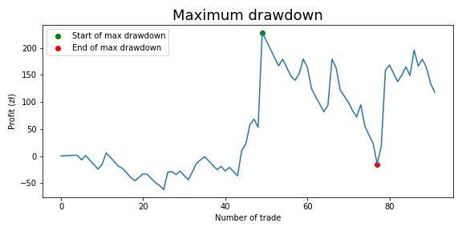
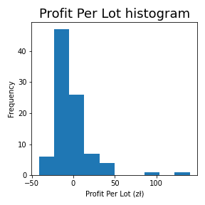
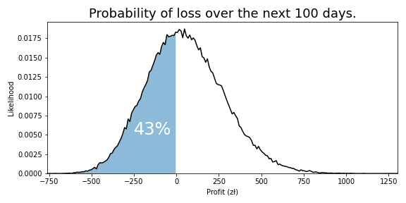

# FX Trading Performance Analysis

**Walk-forward review of an algorithmic trading system over 92 broker-reported trades —
distribution fitting, drawdown and loss-run statistics, and a 100,000-run Monte Carlo
estimate of forward expectancy.**



---

## Why I built this

A single profit-and-loss number says almost nothing about a trading system. A strategy can be
net profitable and still be one losing streak away from ruin, and the headline profit figure
will never show that.

So the brief was to go beyond P&L:

1. Characterise the **shape** of returns.
2. Quantify **drawdown** and consecutive-loss risk.
3. Look for genuine **timing effects** rather than noise.
4. Estimate what the **next 100 trades** are likely to deliver.

## At a glance

| | |
| --- | --- |
| **Trades analysed** | 92 |
| **Monte Carlo runs** | 100,000 |
| **Instruments** | 6+ (FX pairs and commodities) |
| **Win rate** | ~40% |
| **Stack** | Python 3, SciPy, pandas, Matplotlib, Jupyter |

## Data

A broker-generated trade report exported as CSV from MetaTrader / MQL4.

Handling decisions:

- The algorithm's magic-number identifier was corrected from `12345` to `4444` so its trades
  could be isolated from manual ones.
- Price, lot and completeness checks all passed: **no missing values, no non-positive sizes**.
- Duration, direction and stop-loss / take-profit flags were parsed out of the `Comment` column.
- Symbol names stripped of `+` and `.` so instruments group correctly.

> The dataset is intentionally **private**. Reproduction requires your own broker export.

The single notebook, `Trading Results Analysis.ipynb`, runs the whole review:

```bash
pip install -r requirements.txt
jupyter lab "Trading Results Analysis.ipynb"
```

## Method

1. **Repair and validate** — fix the magic-number mismatch, validate open/close prices and lot
   sizes, normalise symbol names.
2. **Feature extraction** — `net profit = Profit + Swap + Commission`; profit-per-lot normalises
   across position sizes; holding period in minutes; SL/TP exit flags decoded from the comment field.
3. **Distributional analysis** — histogram plus skewness and kurtosis on profit per lot, with the
   empirical CDF tested against power-law and exponential fits.
4. **Risk statistics** — peak-to-trough drawdown from the cumulative profit curve, its duration,
   and loss-run lengths modelled with a geometric distribution.
5. **Monte Carlo forward estimate** — 100,000 simulations of 100 trades, resampling observed
   profit-per-lot with replacement at a fixed 0.01 lot, to produce 5th and 95th percentile outcomes.

## Key findings

| # | Finding | Evidence |
| --- | --- | --- |
| 1 | **Positive total P&L, negative median** | The system is net profitable, yet the median trade loses money — small frequent stop-loss hits paid for by occasional large wins, the signature of a defined-risk strategy |
| 2 | **Returns are leptokurtic** | Fat tails relative to a normal distribution mean extreme outcomes are more likely than a Gaussian predicts, which is exactly why a plain VaR would understate risk here |
| 3 | **Two hours show a real edge** | Median profit per lot is positive for trades opened at **14:00** and **16:00** — aligning with macro news releases and the European session-close liquidity transition |
| 4 | **Loss runs are the real exposure** | With a ~60% loss rate, a geometric model puts ten consecutive losses well inside the realm of possibility — the number that actually decides position sizing |

### Instrument breakdown

Median profit per lot by symbol and direction over the one-month window:

| Instrument | Direction | Outcome |
| --- | --- | --- |
| USDCHF | short | **best performer** |
| US500 | long | **worst performer** |
| — | all | win rate ~40%, loss rate ~60% |
| — | all | trade duration 2 minutes → ~4 days |

## Charts

**Profit per lot** — right-skewed, with the bulk of trades sitting slightly below zero:



**Monte Carlo distribution over the next 100 trades** — the 5th and 95th percentile band:



## Limitations — stated plainly

- **92 trades is a small sample.** The statistics are indicative, not conclusive.
- Only closed trades are present — open positions and survivorship effects are invisible.
- Market outcomes are autocorrelated, which breaks the independence assumption behind the Monte Carlo.
- No spread, slippage or commission model, so net P&L is optimistic.
- The 14:00 / 16:00 pattern may be a chance discovery in a single month of data.

## Next steps

- Roll the window forward and re-test on each new month to see if the timing edge survives.
- Layer in spread, slippage and commission to get a realistic net expectancy.
- Benchmark against a buy-and-hold and a random-entry baseline to isolate genuine alpha.
- Build a small dashboard that reports daily P&L, drawdown and loss-run statistics automatically.

## Status

**In progress** — the analysis runs end to end, and the timing edge still needs a second
month of data before it can be called real.

## License and attribution

Adapted from an MIT-licensed open-source analysis. MIT Licence. Documentation, statistics write-up
and charts in this repository were reworked and extended for this project. See [LICENSE](LICENSE).

---

**Muskan Choudhary** · [Portfolio case study](https://muskan-choudhary.vercel.app/projects/fx-trading-performance-analysis) ·
[LinkedIn](https://www.linkedin.com/in/muskiee) · [GitHub](https://github.com/Heyymuskie)
